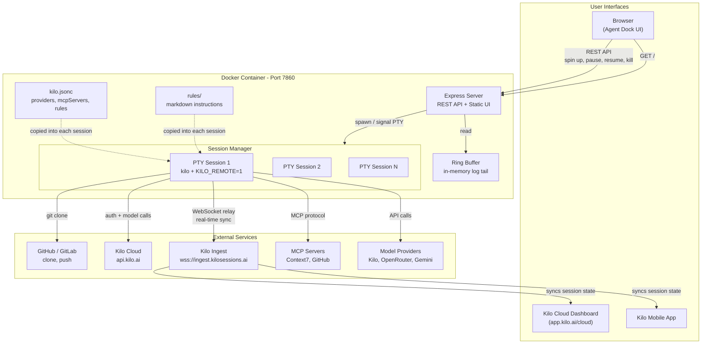

## What is Agent Dock

Agent Dock is a self-hosted web UI and REST API that manages [Kilo CLI](https://kilo.ai) coding sessions. Give it a Git repository URL and a branch — it clones the repo, spins up an interactive Kilo session in a PTY, and connects it to the Kilo Cloud Dashboard via WebSocket relay. From there you can send prompts, pause/resume work, kill sessions, and view logs, all from the browser.

The key value: sessions started through Agent Dock are not locked to the server. Once a session is live, it is available on the **Kilo Cloud Dashboard** (web) and the **Kilo mobile app**. You can start work on your machine, continue it from your phone on the train, and review the diff from the dashboard — no reconnection, no context loss. Agent Dock acts as the orchestration layer that creates and manages these sessions, while Kilo's own infrastructure handles the real-time sync across devices.

Agent Dock is provider-agnostic at the config level. It ships with Kilo as the default backend but supports OpenRouter, OpenCode, Gemini, and custom providers. MCP servers (Context7, GitHub, etc.) can be added by dropping a config block into `kilo.jsonc`. Rules, model preferences, and tool permissions are all configurable without code changes.

## How to get started

```bash
# Build
docker build -t agent-dock .

# Run (minimal)
docker run -p 7860:7860 agent-dock

# Run with secrets
docker run -p 7860:7860 \
  -e AGENT_DOCK_API_TOKEN=your-token \
  -e KILO_API_KEY=your-kilo-key \
  -e GITHUB_TOKEN=ghp_... \
  agent-dock
```

Open `http://localhost:7860` in your browser. Enter a repo URL and branch, click **Spin Up Agent**.

## Secrets

All configuration is passed via environment variables. You can pass each key individually with `-e`, or bundle them into a single `AGENT_DOCK_SECRETS` JSON blob.

| Secret | Required | Description |
|---|---|---|
| `AGENT_DOCK_API_TOKEN` | optional | Bearer token for API and UI authentication. Auto-generated 48-char hex if omitted — the token is never logged, only its length. |
| `KILO_API_KEY` | recommended | Kilo Cloud authentication key. Written to `auth.json` on boot. Without it, the session still runs locally but cannot relay to the Cloud Dashboard or mobile app. |
| `GITHUB_TOKEN` | optional | GitHub personal access token. Enables cloning private repos and authenticates `git push` to github.com via a `url.insteadOf` rewrite configured at startup. Without it, pushes to github.com fail with "no stored credentials". |
| `GIT_USER_NAME` | optional | Git committer name. Required by `git commit` and pre-commit hooks. Default: `Agent Dock`. |
| `GIT_USER_EMAIL` | optional | Git committer email. Required by `git commit` and pre-commit hooks. Default: `agent-dock@local`. |
| `CONTEXT7_API_KEY` | optional | API key for the Context7 MCP server. Enables the agent to query live library documentation during sessions. |
| `OPENROUTER_API_KEY` | optional | OpenRouter provider key. Grants access to additional models (Claude, GPT-4, etc.) through OpenRouter's API. |
| `OPENCODE_API_KEY` | optional | OpenCode provider key (zen/v1 endpoint). Alternative model access. |
| `GEMINI_API_KEY` | optional | Google Gemini key. Used for embedding-based code indexing. |
| `JINA_API_KEY` | optional | Jina openai-compatible embedding provider for indexing. |

### Example: individual flags

```bash
docker run -p 7860:7860 \
  -e KILO_API_KEY=... \
  -e GITHUB_TOKEN=ghp_... \
  -e CONTEXT7_API_KEY=ctx7sk-... \
  -e OPENROUTER_API_KEY=sk-or-... \
  agent-dock
```

### Example: single JSON blob

```bash
docker run -p 7860:7860 \
  -e AGENT_DOCK_SECRETS='{"KILO_API_KEY":"...","GITHUB_TOKEN":"ghp_...","CONTEXT7_API_KEY":"ctx7sk-..."}' \
  agent-dock
```

## Where to host

Agent Dock runs anywhere Docker runs — your local machine, a cloud VM, a VPS, or a container orchestrator (ECS, GKE, Kubernetes, Nomad, etc.).

Expose port `7860` and pass your secrets as environment variables. For production use, place it behind a reverse proxy (Caddy, Nginx, Traefik) with TLS termination.

## Features and current compatibility

| Feature | Status |
|---|---|
| Kilo CLI session management (spin up, pause, resume, kill) | done |
| Kilo Cloud Dashboard relay (WebSocket) | done |
| Kilo mobile app access to active sessions | done |
| Browser-based management UI | done |
| REST API with bearer-token auth | done |
| Per-IP rate limiting | done |
| Automatic session recovery on restart | done |
| Private repo cloning via `GITHUB_TOKEN` | done |
| Device-auth login flow (no manual token paste) | done |
| PTY log viewer with ANSI stripping | done |
| Multiple model/provider support | done |

**Why Kilo CLI:** Kilo was chosen because it already ships with a Cloud Dashboard (`app.kilo.ai/cloud`) and a mobile app. When Agent Dock starts a session with `KILO_REMOTE=1`, that session is immediately visible on both the dashboard and the mobile app. This means a single session can be operated from three interfaces — the Agent Dock UI, the Cloud Dashboard, and the mobile app — without any additional setup. Pause on your laptop, resume from your phone, review logs on the dashboard. The session state is synced through Kilo's WebSocket relay to `ingest.kilosessions.ai`, so all three surfaces see the same conversation and file changes in real time.

**Providers:** Kilo (default), OpenRouter, OpenCode, Gemini, Jina embeddings.

**MCP servers:** Context7 (live library docs), GitHub (PRs/issues, code search).

## Configuring MCP servers, providers, rules, and tools

Agent Dock delegates all agent configuration to Kilo's config system. The main config file is `kilo.jsonc` in the working directory of each session.

### Adding an MCP server

Add a `mcpServers` block to `kilo.jsonc`:

```jsonc
{
  "mcpServers": {
    "context7": {
      "command": "npx",
      "args": ["-y", "@upstash/context7-mcp"],
      "env": { "CONTEXT7_API_KEY": "${env:CONTEXT7_API_KEY}" }
    },
    "github": {
      "command": "npx",
      "args": ["-y", "@modelcontextprotocol/server-github"],
      "env": { "GITHUB_PERSONAL_ACCESS_TOKEN": "${env:GITHUB_TOKEN}" }
    }
  }
}
```

The `${env:VAR}` syntax pulls values from environment variables at runtime. Any MCP-compatible server can be added this way — just set the command, args, and required env vars.

### Adding a provider

To use a model provider other than the default Kilo backend:

1. Set the provider's API key as an environment variable (e.g. `OPENROUTER_API_KEY`).
2. Set `AGENT_DOCK_DEFAULT_MODEL` to the model ID from that provider (e.g. `openrouter/anthropic/claude-sonnet-4-20250514`).

Agent Dock passes the model selection to Kilo at session start. Kilo handles the actual API calls.

### Adding rules

Rules are Markdown files that guide the agent's behavior. Place them in the `rules/` directory at the project root:

```
rules/
  rtk-rules.md      # shell command routing through RTK
  code-style.md     # coding conventions
  security.md       # forbidden operations
```

Rules are copied into each session's `.kilo/rules/` directory at spin-up. The agent reads them as system-level instructions.

### Adding tools or extensions

Kilo supports tool extensions via MCP servers (see above) and built-in tool configurations in `kilo.jsonc`. To restrict or allow specific tools:

```jsonc
{
  "permissions": {
    "allowed": ["bash", "read", "write", "glob", "grep"],
    "denied": ["bash:risky-command"]
  }
}
```

Tool permissions are evaluated per-session. The `rules/` directory is the recommended place for project-specific restrictions (e.g., banning `git push`, blocking NSE URLs).

## Architecture



No separate `kilo daemon` or `kilo remote` processes. Each PTY session with `KILO_REMOTE=1` auto-enables its own remote WebSocket to `wss://ingest.kilosessions.ai`. The TUI manages its own server, ingest HTTP client, and remote connection internally. Session IDs and ingest breadcrumbs are read from kilo's internal log files (`/data/kilo/log/*.log`), not from PTY stdout.

### Request flow

1. User clicks **Spin Up Agent** in the browser.
2. Express server clones the repo, copies `rules/` into the work directory, spawns `kilo` in a PTY with `KILO_REMOTE=1`.
3. Kilo connects to `ingest.kilosessions.ai` via WebSocket — the session is now live on the Cloud Dashboard and mobile app.
4. The initial prompt is sent. Kilo calls the configured model provider (Kilo backend, OpenRouter, etc.) and MCP servers as needed.
5. User can pause (SIGTERM), resume (re-fork with `--cloud-fork`), or kill the session from any interface.
6. Logs are streamed to the ring buffer and viewable in the Agent Dock UI.
