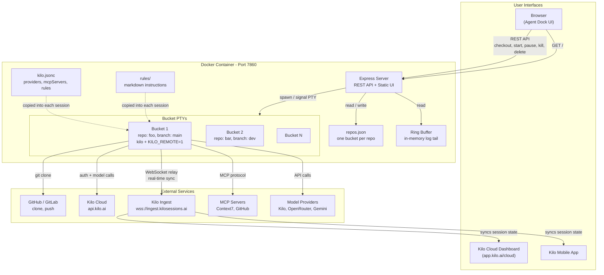

## What is Agent Dock

Agent Dock is a self-hosted web UI and REST API that manages [Kilo CLI](https://kilo.ai) coding sessions. Give it a Git repository URL and optionally a branch (defaults to `main`) — it clones the repo, spins up an interactive Kilo session in a PTY, and connects it to the Kilo Cloud Dashboard via WebSocket relay. From there you can send prompts, pause/resume work, kill sessions, and view logs, all from the browser.

Agent Dock uses a **one-bucket-per-repo** model: each unique repo URL (matched by its basename, e.g. `myrepo`) gets exactly one bucket in the local registry. The bucket holds the cloned work directory, the kilo cloud-session id, the PTY pid, and the last-known state. Checking out the same repo URL again reuses the existing bucket — you don't get duplicate work trees. Branch is **a snapshot from checkout, not a constraint**: it is read best-effort from `git rev-parse` on each poll and can be switched inside the TUI without invalidating the bucket.

The key value: sessions started through Agent Dock are not locked to the server. Once a session is live, it is available on the **Kilo Cloud Dashboard** (web) and the **Kilo mobile app**. You can start work on your machine, continue it from your phone on the train, and review the diff from the dashboard — no reconnection, no context loss. Agent Dock acts as the orchestration layer that creates and manages these sessions, while Kilo's own infrastructure handles the real-time sync across devices.

Agent Dock is provider-agnostic at the config level. It ships with Kilo as the default backend but supports OpenRouter, OpenCode, Gemini, and custom providers. MCP servers (Context7, GitHub, etc.) can be added by dropping a config block into `kilo.jsonc`. Rules, model preferences, and tool permissions are all configurable without code changes.

## How to get started

```bash
# Build
docker build -t agent-dock .

# Run (minimal)
docker run -p 7860:7860 agent-dock

# Run with secrets
docker run -p 7860:7860 \
  -e AGENT_DOCK_API_TOKEN=your-token \
  -e KILO_API_KEY=your-kilo-key \
  -e GITHUB_TOKEN=ghp_... \
  agent-dock
```

Open `http://localhost:7860` in your browser. Enter a repo URL (must end in `.git`), optionally a branch (defaults to `main`), click **Checkout & Start**.

## Secrets

All configuration is passed via environment variables. You can pass each key individually with `-e`, or (when deployed on Hugging Face Spaces) bundle them into a single `HF_SECRETS` JSON blob parsed at boot.

| Secret | Required | Description |
|---|---|---|
| `AGENT_DOCK_API_TOKEN` | optional | Bearer token for API and UI authentication. Auto-generated 48-char hex if omitted — the token is never logged, only its length. |
| `KILO_API_KEY` | recommended | Kilo Cloud authentication key. Written to `auth.json` on boot. Without it, the session still runs locally but cannot relay to the Cloud Dashboard or mobile app. |
| `GITHUB_TOKEN` | optional | GitHub personal access token. Enables cloning private repos and authenticates `git push` to github.com via a `url.insteadOf` rewrite configured at startup. Without it, pushes to github.com fail with "no stored credentials". |
| `GIT_USER_NAME` | optional | Git committer name. Required by `git commit` and pre-commit hooks. Default: `Agent Dock`. |
| `GIT_USER_EMAIL` | optional | Git committer email. Required by `git commit` and pre-commit hooks. Default: `agent-dock@local`. |
| `CONTEXT7_API_KEY` | optional | API key for the Context7 MCP server. Enables the agent to query live library documentation during sessions. |
| `OPENROUTER_API_KEY` | optional | OpenRouter provider key. Grants access to additional models (Claude, GPT-4, etc.) through OpenRouter's API. |
| `OPENCODE_API_KEY` | optional | OpenCode provider key (zen/v1 endpoint). Auto-activates kilo's native `opencode` provider. |
| `IAMHC_API_KEY` | optional | IAMHC OpenAI-compatible provider key. Grants access to GLM, MiniMax, Kimi, and DeepSeek models via `https://api.iamhc.cn/v1` (declared in `kilo.jsonc`). |
| `GEMINI_API_KEY` | optional | Google Gemini key. Used for embedding-based code indexing. |
| `JINA_API_KEY` | optional | Jina openai-compatible embedding provider for indexing. |
| `KILO_AUTH_TOKEN` | optional | Alternative to `KILO_API_KEY` for Kilo Cloud auth. Written to `auth.json` as an API-type key on boot if `KILO_API_KEY` is absent. |
| `AGENT_DOCK_INITIAL_PROMPT` | optional | Overrides the prompt auto-submitted when a session starts or resumes. Defaults to `based on readme explain project in 2 lines`. |
| `AGENT_DOCK_RATE_LIMIT` | optional | Set to `off` to disable per-IP rate limiting (test mode only). Any other value keeps the limits on. |

### Example: individual flags

```bash
docker run -p 7860:7860 \
  -e KILO_API_KEY=... \
  -e GITHUB_TOKEN=ghp_... \
  -e CONTEXT7_API_KEY=ctx7sk-... \
  -e OPENROUTER_API_KEY=sk-or-... \
  agent-dock
```

### Example: single JSON blob (Hugging Face Spaces)

```bash
docker run -p 7860:7860 \
  -e HF_SECRETS='{"KILO_API_KEY":"...","GITHUB_TOKEN":"ghp_...","CONTEXT7_API_KEY":"ctx7sk-..."}' \
  agent-dock
```

`HF_SECRETS` is parsed by `entrypoint.sh` at boot — each JSON key is exported as its own environment variable before the Node server starts, so `kilo.jsonc`'s `${env:VAR}` placeholder resolution works the same way as individual `-e` flags.

## Where to host

Agent Dock runs anywhere Docker runs — your local machine, a cloud VM, a VPS, or a container orchestrator (ECS, GKE, Kubernetes, Nomad, etc.).

Expose port `7860` and pass your secrets as environment variables. For production use, place it behind a reverse proxy (Caddy, Nginx, Traefik) with TLS termination.

## Features and current compatibility

| Feature | Status |
|---|---|
| One-bucket-per-repo session management (checkout, start, pause, kill, delete) | done |
| Smart resume — server resumes cloud session or returns `needs_new_session` for gone sessions | done |
| Cloud liveness refresh (`unknown` / `active` / `deleted`) after Start/Resume | done |
| Row-level lock + status line UX — buttons disable mid-action, "Working: …" label, poll confirms new state before unlock | done |
| Kilo Cloud Dashboard relay (WebSocket) | done |
| Kilo mobile app access to active sessions | done |
| Browser-based management UI (Repo List, Diagnostics, Logs, Auth tabs) | done |
| REST API with bearer-token auth | done |
| Per-IP rate limiting | done |
| Private repo cloning via `GITHUB_TOKEN` | done |
| Device-auth login flow (no manual token paste) | done |
| PTY log viewer with ANSI stripping | done |
| Multiple model/provider support | done |

**Why Kilo CLI:** Kilo was chosen because it already ships with a Cloud Dashboard (`app.kilo.ai/cloud`) and a mobile app. When Agent Dock starts a session with `KILO_REMOTE=1`, that session is immediately visible on both the dashboard and the mobile app. This means a single session can be operated from three interfaces — the Agent Dock UI, the Cloud Dashboard, and the mobile app — without any additional setup. Pause on your laptop, resume from your phone, review logs on the dashboard. The session state is synced through Kilo's WebSocket relay to `ingest.kilosessions.ai`, so all three surfaces see the same conversation and file changes in real time.

**Providers:** Kilo (default), OpenRouter, IAMHC (GLM/MiniMax/Kimi/DeepSeek via an OpenAI-compatible endpoint), OpenCode (auto-activated), Gemini and Jina for embeddings.

**MCP servers:** Context7 (live library docs), GitHub (PRs/issues, code search).

## REST API

All endpoints under `/api/*` require `Authorization: Bearer <AGENT_DOCK_API_TOKEN>` except `/api/status`. Write endpoints (POST/DELETE) are rate-limited per IP.

### Bucket lifecycle

| Method | Path | Notes |
|---|---|---|
| `POST` | `/api/repos/checkout` | Body: `{ repo_url, branch? }`. Clones the repo, starts a kilo session, registers a new bucket. Returns `201` with the new bucket, or `409` if a bucket for the same repo already exists (`error: "already checked out"`), a different repo URL collides on the same basename (`error: "bucket collision"`), or auth is invalid (`{ auth_invalid: true }`). |
| `GET`  | `/api/repos` | Returns the bucket registry as a JSON array. Each entry includes `work_dir_identifier`, `repo_url`, `repo_name`, `branch`, `cloud_session_status`, `session_state` (`running` / `paused` / `stopped` / `killed`), `started_at`. |
| `GET`  | `/api/repos/:workDirId` | Single-bucket detail. Returns `404` if not found. |
| `POST` | `/api/repos/:workDirId/start` | Smart resume. If the cloud session is alive, resumes the existing PTY (`resumed_live: true`). If the cloud session is gone, returns `409 { needs_new_session: true, reason }` and the UI opens a confirmation dialog. Other `409`s: `auth_invalid`, `already running`. |
| `POST` | `/api/repos/:workDirId/new-session` | Starts a fresh kilo cloud session in the existing work directory. Used after `start` returns `needs_new_session: true`. File changes are preserved. |
| `POST` | `/api/repos/:workDirId/pause` | Terminates the PTY but preserves `kilo_session_id`. Does not touch the cloud. Bucket transitions `running → paused`. |
| `POST` | `/api/repos/:workDirId/kill` | Terminates the PTY, calls `kilo session delete <id>` (best-effort), marks the bucket as `killed`. Preserves the work directory. |
| `DELETE` | `/api/repos/:workDirId` | Kill + `rm -rf` the work directory + removes the registry entry. The repo can be re-checked out fresh afterwards. |
| `POST` | `/api/repos/:workDirId/continue` | Headless one-shot `kilo run --session <id> --cloud-fork --share` against the bucket's cloud session id (no TUI). Requires a known `kilo_session_id` and the bucket to be **not** `running` (returns `409` if already running). No UI button — for external callers. |

### Other

| Method | Path | Notes |
|---|---|---|
| `GET` | `/` | The HTML UI (served without auth so the browser can render the shell). |
| `GET` | `/health` | Plain `200 ok` — useful for container health checks. |
| `GET` | `/api/status` | Boot diagnostics: `kilo_version`, `kilo_which`, `repo_count`, `default_model`, rate-limit status. No auth required. |
| `GET`  | `/api/logs` | In-memory ring-buffer tail (latest N lines). |
| `GET`  | `/api/logs/session/:id` | Per-PTY kilo log for the bucket whose `work_dir_identifier` is `:id` (under `/data/kilo/session-<id>.log`), ANSI-stripped, last 200 lines. |
| `GET`  | `/api/logs/kilo-internal` | kilo's own log files (under `/data/kilo/log/*.log`). |
| `GET` | `/api/relay-check` | Verifies the per-PTY cloud-relay chain — `auth.json`, `api.kilo.ai`, `ingest.kilosessions.ai`, `kilo.json` config — is healthy. |
| `GET` | `/api/diagnostics` | Server-side diagnostic dump (kilo bin path, version, auth validity). |
| `POST` | `/api/auth/login` | Starts the device-auth flow. Returns `{ status: "pending", url, code }` — the URL and code the user must open in a browser. |
| `GET` | `/api/auth/status` | Polls device-auth progress. Returns `{ status: "idle" | "pending" | "success" | "failed" | "cancelled" }`. |
| `POST` | `/api/auth/cancel` | Cancels an in-flight device-auth flow. |

### State machine

```
running  ──pause──▶  paused
running  ──kill───▶  killed
running  ──PTY dies─▶  stopped   (via updateStatus() on next poll)
paused   ──start──▶  running    (smart resume)
stopped  ──start──▶  running    (smart resume)
killed   ──start──▶  running    (fresh /new-session — no cloud session on record)
any      ──delete─▶  (registry entry + work dir removed)
```

`cloud_session_status` is `unknown` by default and is only refreshed after Start/Resume attempts (`active` when the cloud session is reachable, `deleted` after a Resume reports `importFailed`).

## Configuring MCP servers, providers, rules, and tools

Agent Dock delegates all agent configuration to Kilo's config system. The main config file is `kilo.jsonc` in the working directory of each session.

### Adding an MCP server

Add a `mcpServers` block to `kilo.jsonc`:

```jsonc
{
  "mcpServers": {
    "context7": {
      "command": "npx",
      "args": ["-y", "@upstash/context7-mcp"],
      "env": { "CONTEXT7_API_KEY": "${env:CONTEXT7_API_KEY}" }
    },
    "github": {
      "command": "npx",
      "args": ["-y", "@modelcontextprotocol/server-github"],
      "env": { "GITHUB_PERSONAL_ACCESS_TOKEN": "${env:GITHUB_TOKEN}" }
    }
  }
}
```

The `${env:VAR}` syntax pulls values from environment variables at runtime. Any MCP-compatible server can be added this way — just set the command, args, and required env vars.

### Adding a provider

To use a model provider other than the default Kilo backend:

1. Set the provider's API key as an environment variable (e.g. `OPENROUTER_API_KEY`).
2. Declare the provider in `kilo.jsonc` under `provider.<id>.options` with `apiKey` (`{env:VAR}` syntax) and, for custom OpenAI-compatible endpoints, `baseURL`.
3. Set `AGENT_DOCK_DEFAULT_MODEL` to the model ID from that provider (e.g. `openrouter/anthropic/claude-sonnet-4-20250514`).

Agent Dock passes the model selection to Kilo at session start. Kilo handles the actual API calls.

**Cloud Dashboard visibility.** Every provider declared in `kilo.jsonc` — including custom OpenAI-compatible ones with a `baseURL` — is relayed to the Kilo Cloud Dashboard's model picker for `/remote` sessions via the `list_models` protocol (kilo 7.4.2, PR Kilo-Org/cloud#4325 + Kilo-Org/kilocode#11835). NOTE: 7.4.2 is currently published only as the `rc` dist-tag; `npm install -g @kilocode/cli` (unpinned) pulls the older stable `7.4.1`, which predates the cloud model-picker fix. The Dockerfile pins `@kilocode/cli@7.4.2` for this reason. Inference still runs in this container against the provider's `baseURL`; the dashboard is only a remote view/control surface. So a session started from the Agent Dock UI can be resumed from the Cloud Dashboard or mobile app, and the user can switch models from any of those surfaces.

### Adding rules

Rules are Markdown files that guide the agent's behavior. Place them in the `rules/` directory at the project root:

```
rules/
  rtk-rules.md      # shell command routing through RTK
  code-style.md     # coding conventions
  security.md       # forbidden operations
```

Rules are copied into each session's `.kilo/rules/` directory at checkout. The agent reads them as system-level instructions.

### Skills (Superpowers)

Agent Dock ships the always-available [Superpowers](https://github.com/obra/superpowers) skills, downloaded at Docker build time (see `Dockerfile`) from `obra/superpowers`. They are copied into each session's `.kilo/skills/` directory at checkout, so Kilo auto-discovers them (it scans `.kilo/skills/<name>/SKILL.md`) and the Superpowers methodology — brainstorming, writing-plans, test-driven-development, verification-before-completion, etc. — is available in every session. No per-session setup is required; the skills are read-only in the image and a fresh copy is made per work directory.

### Adding tools or extensions

Kilo supports tool extensions via MCP servers (see above) and built-in tool configurations in `kilo.jsonc`. To restrict or allow specific tools:

```jsonc
{
  "permissions": {
    "allowed": ["bash", "read", "write", "glob", "grep"],
    "denied": ["bash:risky-command"]
  }
}
```

Tool permissions are evaluated per-session. The `rules/` directory is the recommended place for project-specific restrictions (e.g., banning `git push`, blocking NSE URLs).

## Architecture



No separate `kilo daemon` or `kilo remote` processes. Each PTY session with `KILO_REMOTE=1` auto-enables its own remote WebSocket to `wss://ingest.kilosessions.ai`. The TUI manages its own server, ingest HTTP client, and remote connection internally. Session IDs and ingest breadcrumbs are read from kilo's internal log files (`/data/kilo/log/*.log`), not from PTY stdout.

### Request flow

1. User clicks **Checkout & Start** in the browser. The Express server validates the URL, computes the bucket identifier (repo basename), checks the registry for an existing bucket, and — if none — clones the repo, copies `rules/` into the work directory, spawns `kilo` in a PTY with `KILO_REMOTE=1`, and registers a new bucket.
2. Kilo connects to `ingest.kilosessions.ai` via WebSocket — the session is now live on the Cloud Dashboard and mobile app.
3. The initial prompt is sent. Kilo calls the configured model provider (Kilo backend, OpenRouter, etc.) and MCP servers as needed.
4. User can pause (terminates PTY, preserves cloud session id), start (smart-resumes the cloud session, or prompts for a fresh one if it's gone), or kill (terminates PTY + `kilo session delete`, preserves work dir) from the Repo List. The row-level busy lock keeps the buttons disabled and shows a "Working: …" label until the next poll confirms the new state.
5. Logs are streamed to the ring buffer and viewable in the Agent Dock UI's Logs tab.
